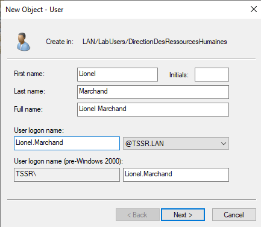

## Exercice 1 : Manipulations pratiques sur VM Windows  

# Partie 1 : Gestion des utilisateurs  

#### Q.1.1.1 Créer l'utilisateur Lionel Lemarchand avec les même attribut de société que Kelly Rhameur.  

Trouver l'utilisateur Kelly Rhameur en ligne de commande  
  

Une fois trouvé, regarder dans quel OU il se trouve et ses propriétés.  
  

Créer Lionel Marchand dans la même OU, l'ajouter au même groupe que Kelly Rhameur, lui donner un mail dans le même format etc
  

#### Q.1.1.2 Créer une OU DeactivatedUsers et déplace le compte désactivé de Kelly Rhameur dedans.  

Desactiver le compte de Kelly Rhameur  

  

Le déplacer dans l'OU DeactivatedUser créée.  

  

#### Q.1.1.3 Modifier le groupe de l'OU dans laquelle était Kelly Rhameur en conséquence.  

  

#### Q.1.1.4 Créer le dossier Individuel du nouvel utilisateur et archive celui de Kelly Rhameur en le suffixant par -ARCHIVE.  

  

# Partie 2 : Restriction utilisateurs

#### Q.1.2.1 Faire en sorte que l'utilisateur Gabriel Ghul ne puisse se connecter que du lundi au vendredi, de 7h à 17h.

Trouver Monsieur Ghul (qui est en réalité Monsieur Guhl)!  

  

Faire la modification.  

    

#### Q.1.2.2 De même, bloquer sa connexion au seul ordinateur CLIENT01.

#### Q.1.2.3 Mettre en place une stratégie de mot de passe pour durcir les comptes des utilisateurs de l'OU LabUsers.

# Partie 3 : Lecteurs réseaux

#### Q.1.3.1 Créer une GPO Drive-Mount qui monte les lecteurs E: et F: sur les clients.

