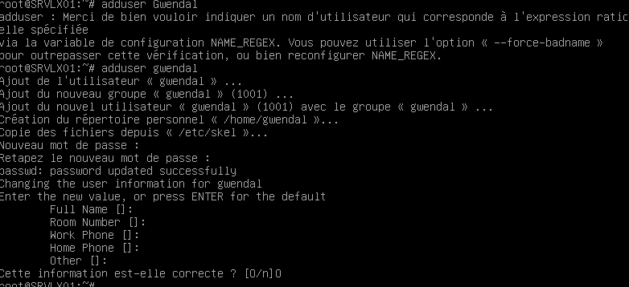
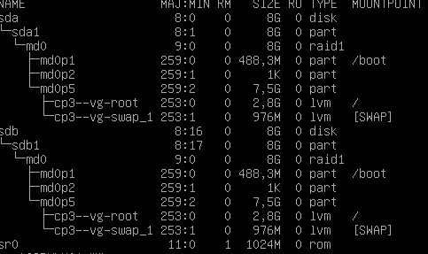
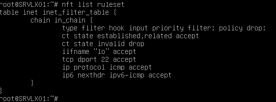

## Partie 1 : Gestion des utilisateurs  

#### Q.2.1.1 Sur le serveur, créer un compte pour ton usage personnel.  

  

#### Q.2.1.2 Quelles préconisations proposes-tu concernant ce compte ?    

Un mot de passe sécurisé, avec 12 valeurs en mixte alphanumérique et caractères spéciaux. 

    
## Partie 2 : Configuration de SSH  

#### Q.2.2.1 Désactiver complètement l'accès à distance de l'utilisateur root.  

Dans etc/ssh/sshd_config modifier :

  

Relancer le service avec systemctl restart ssh  

#### Q.2.2.2 Autoriser l'accès à distance à ton compte personnel uniquement.  

De même dans etc/ssh/sshd_config modifier :  

    

Et relancer le service  

#### Q.2.2.3 Mettre en place une authentification par clé valide et désactiver l'authentification par mot de passe  

Décommenter et modifier les lignes suivantes.  

   

## Partie 3 : Analyse du stockage  

#### Q.2.3.1 Quels sont les systèmes de fichiers actuellement montés ?  

  

#### Q.2.3.2 Quel type de système de stockage ils utilisent ?  

  

On peut aussi un RAID1 (mais ne contenant qu'un seule seule partition donc défectueux, la copie a disparue!) contenant des volumes LVM.

#### Q.2.3.3 Ajouter un nouveau disque de 8,00 Gio au serveur et réparer le volume RAID  

Ajout disque sdb  

  

Formater le disque avec :  
fdisk /dev/sdb   

  

Formater la partition :   
avec mfks.ext4 /dev/sdb1  

  

Réparer le raid avec :  
mdadm --add /dev/md0 /dev/sdb1  

La recovery s'exécute  
 

La réparation est terminée !  

  

   

#### Q.2.3.4 Ajouter un nouveau volume logique LVM de 2 Gio qui servira à héberger des sauvegardes. Ce volume doit être monté automatiquement à chaque démarrage dans l'emplacement par défaut : /var/lib/bareos/storage.  

vgdisplay pour voir les infos du groupe existant.  
puis lvcreate -L 2G -n lv_storage cp3-vg

   

formater et monter  

  

modifier le fichier /dev/fstab pour monter automatiquement au démarrage en ajoutant la ligne : 
/dev/cp3-vg/lv_storage /var/lib/bareos/storage  ext4  defaults  0  2  
(modifier potentiellement /dev/vg_date/lv_backup par son UUID!)  

#### Q.2.3.5 Combien d'espace disponible reste-t-il dans le groupe de volume ?  

  
1.79G !

## Partie 4 : Sauvegardes  

#### Q.2.4.1 Expliquer succinctement les rôles respectifs des 3 composants bareos installés sur la VM.  

bareos-director :  
Le Director est le serveur qui gère la configuration et l'exécution des sauvegardes, et il envoie des commandes aux autres composants.  

bareos-fd :  
Le File Daemon est installé sur les machines à sauvegarder. Il s'agit de la partie cliente responsable des sauvegardes sur les fichiers du système et de l'envoi des données vers le storage daemmon.  

bareos-sd :   
Le Storage Daemon (SD) gère le stockage des données sauvegardées. C'est là où les données de sauvegarde sont réellement stockées.

## Partie 5 : Filtrage et analyse réseau  

#### Q.2.5.1 Quelles sont actuellement les règles appliquées sur Netfilter ?  

  

#### Q.2.5.2 Quels types de communications sont autorisées ?  

Ce sont uniquement des connexions entrantes.  
Le SSH (sur le port 22) et ICMP (en ipv4 et ipv6) ainsi que les flux interne (loopback). 

#### Q.2.5.3 Quels types sont interdit ?  

Tous les autres (policy drop)  

#### Q.2.5.4 Sur nftables, ajouter les règles nécessaires pour autoriser bareos à communiquer avec les clients bareos potentiellement présents sur l'ensemble des machines du réseau local sur lequel se trouve le serveur.  

Trouver l'adresse du réseau local :  

  

Modifier les règles de filrage pour autoriser entrant sur les ports tcp 9101 et 9103 à l'adresse correspondante avec :  
nft add rule inet inet_filter_table in_chain ip saddr 172.16.0.0/16 tcp dport { 9101, 9103 } accept  

Puis vérifier le changement avec :  
nft list table inet inet_filter_table  

  

Il n'y a pas de règles particulières sur le trafic sortant et nous allons laisser ça tel quel.  

## Partie 6 : Analyse de logs  

#### Q.2.6.1 Lister les 10 derniers échecs de connexion ayant eu lieu sur le serveur en indiquant pour chacun :  

 

